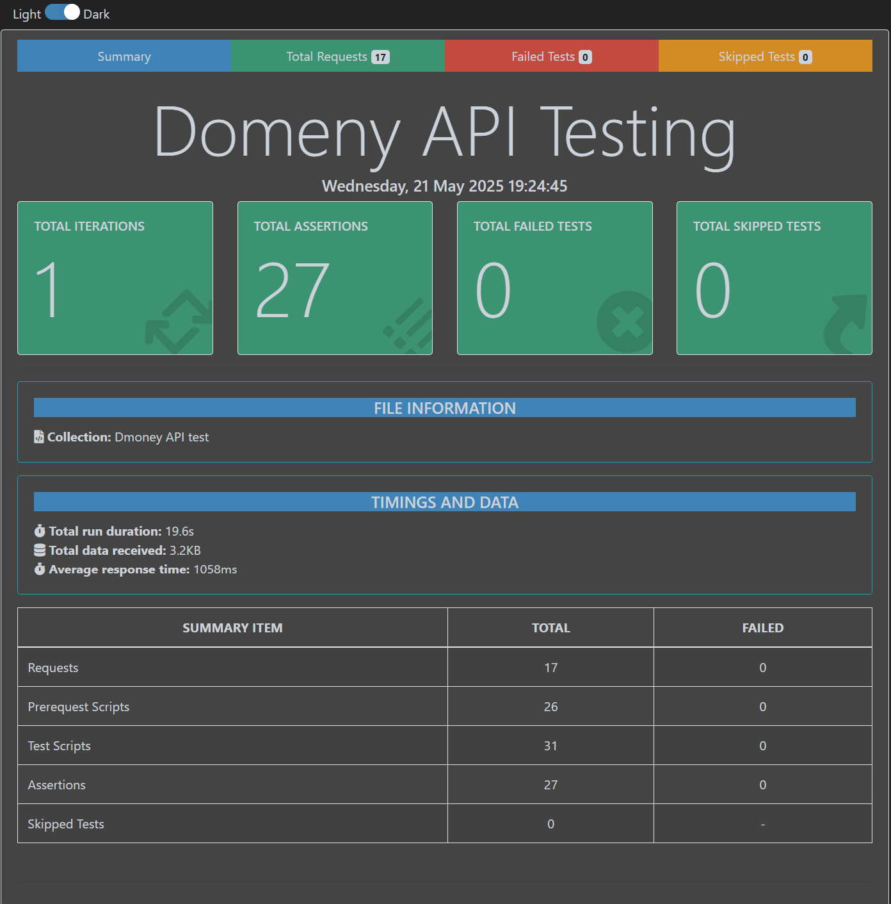

# Dmoney-User-Mangament-API-test
# Dmoney-REST-API-Test-Project
## Project Overview
- This project focuses on testing **the Dmoney REST API** to ensure its user-related functionalities work as intended, identify any potential issues, and provide suggestions for improvement. The testing specifically covers operations related to user management, including the creation, updating, listing, searching, and deletion of users. Various user roles were tested, such as Admin, System User, Agent, Customer, and Merchant. The primary objective was to validate the accuracy and reliability of these user-related endpoints within the API.
---
## Tools and Technology
- Postman
- Newman
- Nodejs
- VSCode
---
## Tasks and Flows

### 1. **Test Cases**
Created **test cases** for the following scenarios:
- Admin creates an Agent, 2 Customers, and a Merchant.
- User Creation (Admin Role)
- Update User Information
- List All Users
- Search for a User
- Delete a User

**The test cases are:** [Click Here to see the Test Cases](https://docs.google.com/spreadsheets/d/1lzlmqQpxDneZLgB7tEB7XyWSJDwZPGAXfke_PhftJRw/edit?gid=765236397#gid=765236397)

---

### 2. **Postman Collection**
- Created a Postman collection for all the scenarios.
- Added **negative test cases** for validation and error handling.
- Collection [Click Here to see the Postman Collection](https://elements.getpostman.com/redirect?entityId=44634400-84c5598f-a86d-4a7d-9c05-e9f742187270&entityType=collection)
- Endpoints Used:
  - [User API](http://dmoney.roadtocareer.net/api-docs/user)
  - [Transaction API](http://dmoney.roadtocareer.net/api-docs/transaction)
---

### 3. **Newman Report**
- Generated a report of all test cases using Newman.
- Included summary screenshots of the execution.

View the Newman report screenshots below:
![image]

---

### 4. **Postman Documentation**
Postman documentation for the test cases and endpoints is available:  
[Click here to view Postman Documentation](https://documenter.getpostman.com/view/44634400/2sB2qXjhq2).

---

### 5. **Bug Report**
Reported **Bug or Improvements** in a Google Sheet, with details such as:
- Issue Type (Bug/Improvement)
- Issue Title
- Description and Steps to Reproduce
- Actual vs Expected Results
- Priority and Severity
- Attachments with screenshots

**To see the bug report:** [Click here to view Bug Report](https://docs.google.com/spreadsheets/d/12vwtz7RmR-loM8rA6ah4WxmBoue8nkmCwDl7kZBO4c4/edit?gid=0#gid=0).

---
## Follow these instructions to set up and run the project locally.

This project is designed to test the Dmoney REST API using JavaScript. It utilizes Node.js to run the test scripts and I provide a step-by-step guide for anyone to clone and run the project on their machine.

### Prerequisites

Ensure you have the following installed on your machine:  
- [Node.js](https://nodejs.org/) (version 14.x or later)  
- [Git](https://git-scm.com/)

### Installation

1. **Clone the Repository**  
   Open your terminal and run:  
   `git clone https://github.com/maynul1997/Dmoney-User-Mangament-API-test.git`

2. **Navigate to the Project Directory**  
   Change your working directory to the cloned repository:  
   `cd Dmoney-REST-API-Test`

3. **Install Dependencies**  
   Install the required dependencies using npm:  
   `npm install`

### Running the Project

Run the `Report.js` script using Node.js in the terminal:  
`npx newman run "copy & paste published collection link without inverted comma"`
Then 
`node Report.js`

### Expected Output

The script will run tests against the Dmoney REST API and display the results in the terminal.

## Contact

For any questions or issues, feel free to open an issue in the repository or contact me via - mamun.harf@gmail.com